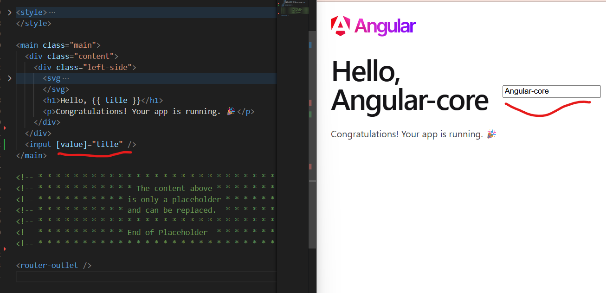
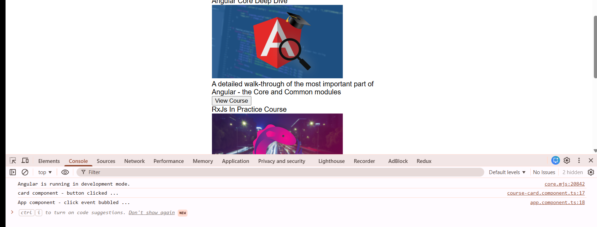
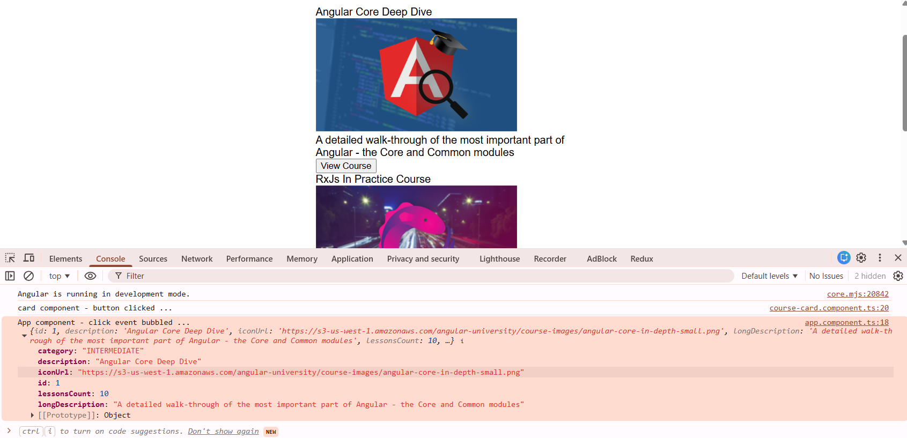
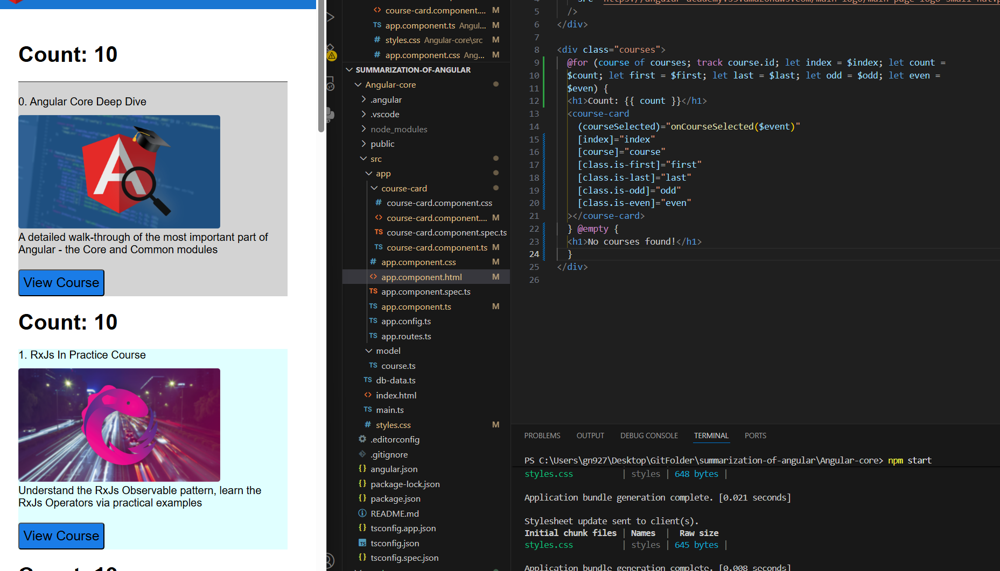
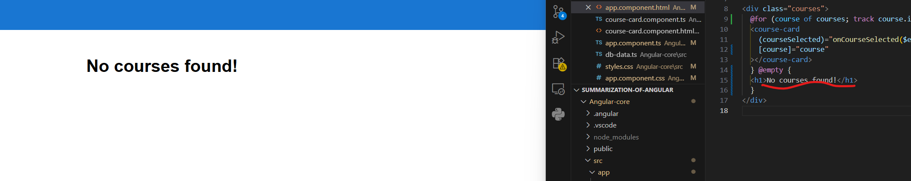
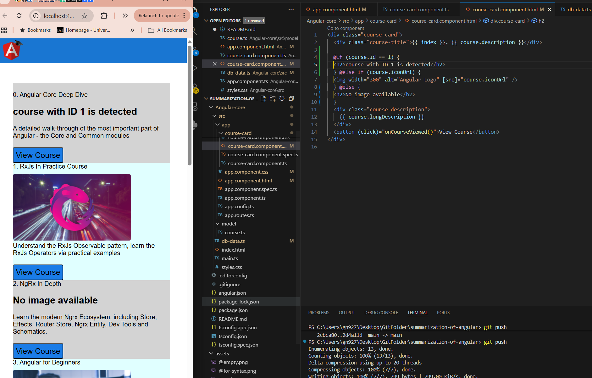
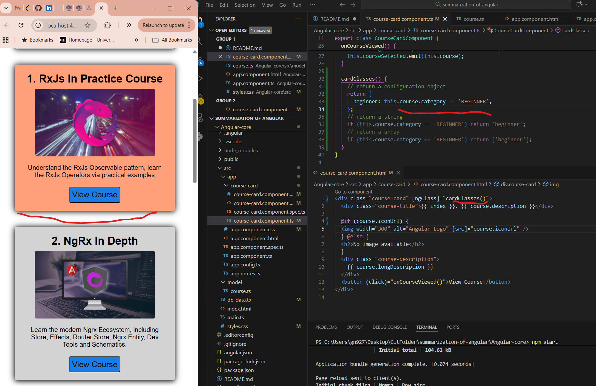
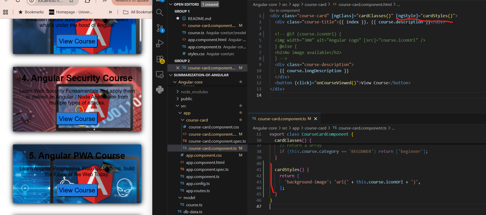

# Summarization of Angular

- The main feature of Angular core is the ability of defining our own custom HTML elements:
  
  this effictively allows us to extend the browser funtionality with our own functionality

- The second key property of Angular core is the ability that it gives us to build our program in a way where our data available at the level of the component and our view which is defined by the HTML templates are completely separate. We can bind two things together using interpolation syntax
  
  

- Pass data to the template: property binding
  

- Handle browser native events: event binding:
  

- Template reference is simply pointing to the native Dom element that corresponds here to the input:
  

  - one of the core feature of Angular - automatically reflexting in the view any modification that we do to the data
  - this synchronization is done in a secure way: html, javascript escaping
    

- Create a custom HTML element: https://github.com/GongVictorFeng/summarization-of-angular/commit/b20c37559d6f2b202bfaed92c3dafe14fac501c3

- Add configurable property for the custome HTML element:

  - created a custom javascript object type for type safety: https://github.com/GongVictorFeng/summarization-of-angular/commit/23ac69d0900e7dfeadc9f909ece3813c214a84cc
  - made course a configuration property and use it in the template: https://github.com/GongVictorFeng/summarization-of-angular/commit/9cd55eb7b8a341320f3239d3df2e05f26411a5d7
  - injected the data to the course card element: https://github.com/GongVictorFeng/summarization-of-angular/commit/51329dae67e318c6a222f90e6a787c24dd707bec

- emit custom events:

  - Add a standard browser event - will bubble up: https://github.com/GongVictorFeng/summarization-of-angular/commit/6c875fd83c3a5357e79c315c0304f004d32a0c2a
    
  - Add a custom event - will not bubble up: https://github.com/GongVictorFeng/summarization-of-angular/commit/0e555864190f1c44ece88a67e381076882f4f772
    

- Control Flow Syntax and core directives

  - @for - loop through an array and avoid doing duplicate code: https://github.com/GongVictorFeng/summarization-of-angular/commit/2d4a11d5c232988253c55c317a4dba017adfd46f
    

    - $index - variable contains the index of element being currently iterated
    - $count - contains the number of elements in the iterable
    - $first - identifies the first element
    - $last - identifies the last element
    - $even - identifies the index assigned is even number
    - $odd - identifies the index assigned is odd number
    - tracking function - helps uniquely identify each element. it helps Angular, especially the @for syntax to optimize the way in which the Dom gets rendered. Angular will differentiate new version of the list with the old version, only render the updated part. For instance, if you add a new element to the list, Angular can only render the new one rather than rendering the whole list again with the help of unique identifier.
      - Angular allow to write custom tracking function: https://github.com/GongVictorFeng/summarization-of-angular/commit/326504fc66b1d482d59c8d204da15db7026422ad
    - @empty allow you to display something in place of the list looping through in case the list is empty
      

  - @if - conditional rendering: https://github.com/GongVictorFeng/summarization-of-angular/commit/1cfb1d93b65d696dfb0ff543f0878499f2f49e19#diff-88dcff618eb27f9c6b7323b3cd09d8e379407e852324e690fb22ce266680afd4
    

  - ngClass - conditional styles that are added or remove classes to sections of the page depending on the state

    - we can pass an array, a string and a configuration object
    - https://github.com/GongVictorFeng/summarization-of-angular/commit/7642daba0490c113474a9ad07363c4ec0ce72a7a
      

  - ngstyle - apply a style directly to a component

    - pass configuration object for multiple styles
    - https://github.com/GongVictorFeng/summarization-of-angular/commit/713d9aa56d7bb46cb56224a08b248bd91ba2511c
    - 

  - styling components

    - style with plain CSS classes - most common
    - ngclass for adding and removing classes depending on the state - only for CSS state classes
    - ngstyle for CSS properties that we want to populate depending on the data - background image

  - @switch - conditional rendering: https://github.com/GongVictorFeng/summarization-of-angular/commit/8074d41ed6b0fa5ec818a4e1330ee9147242d449
  - ngContainer - component does not have a top level element. No need to create extra wrapper elements just to apply a structure directive, we can instead use the NG container directive
    - wrapping container element, we can apply a strucutre directive
    - https://github.com/GongVictorFeng/summarization-of-angular/commit/12c80f9d892a877541a168a36211272f7645e312
