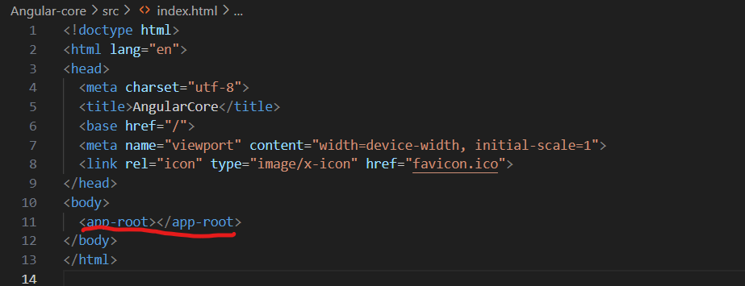
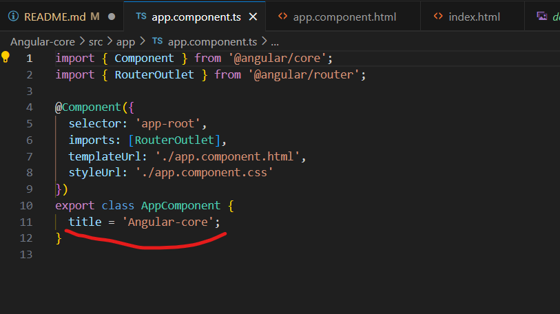
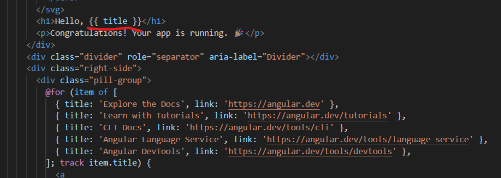
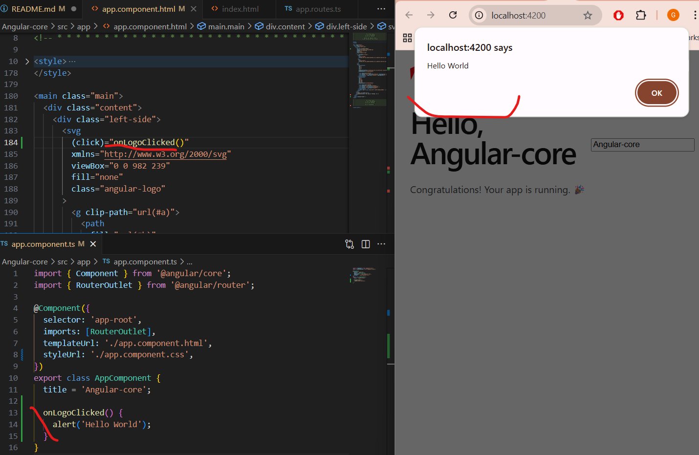
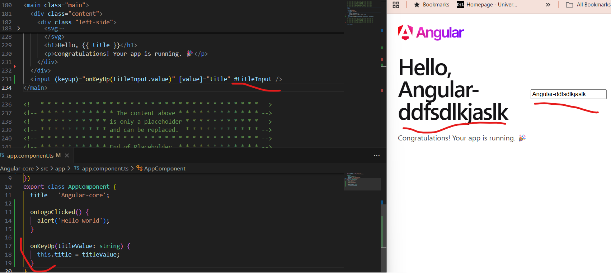
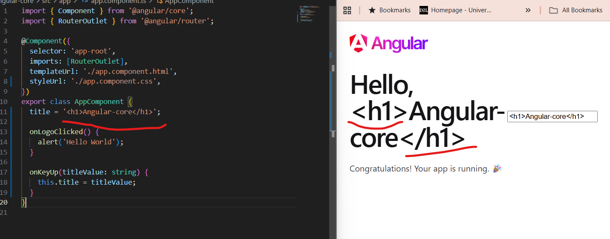

# Summarization of Angular

- The main feature of Angular core is the ability of defining our own custom HTML elements:
  
  this effictively allows us to extend the browser funtionality with our own functionality

- The second key property of Angular core is the ability that it gives us to build our program in a way where our data available at the level of the component and our view which is defined by the HTML templates are completely separate. We can bind two things together using interpolation syntax
  
  

- Pass data to the template: property binding
  

- Handle browser native events: event binding:
  

- Template reference is simply pointing to the native Dom element that corresponds here to the input:
  
  - one of the core feature of Angular - automatically reflexting in the view any modification that we do to the data
  - this synchronization is done in a secure way: html, javascript escaping
    
